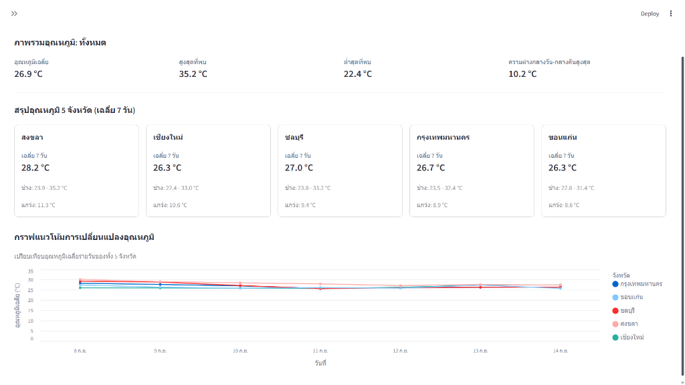
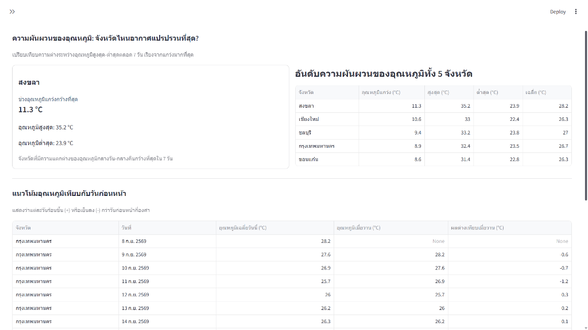
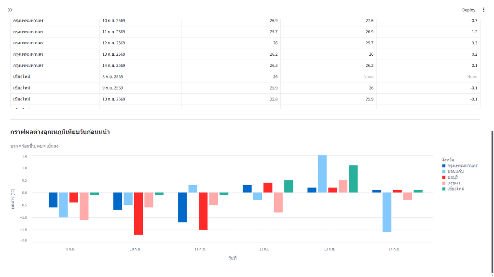

# Weather Data Pipeline

โปรเจกต์ระบบประมวลผลข้อมูลสภาพอากาศอัตโนมัติ (ETL) ดึงข้อมูลพยากรณ์อากาศล่วงหน้า 7 วัน รายชั่วโมง จาก Open-Meteo API ครอบคลุม 5 จังหวัด (กรุงเทพมหานคร, เชียงใหม่, ชลบุรี, ขอนแก่น, สงขลา) จัดเก็บลงฐานข้อมูล SQLite วิเคราะห์ข้อมูลเชิงลึกด้วย SQL และแสดงผลผ่าน Interactive Dashboard ด้วย Streamlit

### เครื่องมือที่ใช้ (Tech Stack)
- **Language**: Python 3
- **Data Pipeline (ETL)**: Requests, Pandas
- **Database**: SQLite
- **Analytics**: SQL (Window Functions, Aggregation)
- **Visualization**: Streamlit, Altair

---

## ตัวอย่างการแสดงผลบน Dashboard (Streamlit)

ระบบแสดงผลข้อมูลสภาพอากาศผ่าน Interactive Dashboard โดยอ่านข้อมูลตรงจากฐานข้อมูล SQLite:

### 1. ภาพรวมอุณหภูมิรายวันและแนวโน้ม 5 จังหวัด
แสดงสถิติภาพรวม การ์ดสรุปอุณหภูมิ 5 จังหวัด (เฉลี่ย 7 วัน) และกราฟเส้นเปรียบเทียบแนวโน้มอุณหภูมิ

### 2. อันดับความผันผวนของอุณหภูมิและตารางเปรียบเทียบ
แสดงจังหวัดที่อุณหภูมิแกว่งกว้างที่สุด (สงขลา 11.3°C) พร้อมตารางแสดงแนวโน้มอุณหภูมิเทียบกับวันก่อนหน้า

### 3. กราฟเปรียบเทียบผลต่างอุณหภูมิเทียบวันก่อนหน้า
กราฟแท่งแสดงอัตราการเปลี่ยนแปลงอุณหภูมิในแต่ละวัน (บวก = ร้อนขึ้น, ลบ = เย็นลง)

---

## การออกแบบ Database Schema

ระบบใช้ฐานข้อมูล SQLite โดยออกแบบแยกเป็น 2 ตารางเพื่อลดความซ้ำซ้อนของข้อมูล (Normalization):

1. **ตาราง `cities` (ตารางข้อมูลเมือง)**: เก็บข้อมูลพื้นฐาน ได้แก่ รหัสเมือง (`city_id`), ชื่อเมือง (`city_name`) และพิกัดละติจูด/ลองจิจูด มีข้อมูลทั้งหมด 5 แถวตามจำนวนจังหวัด
2. **ตาราง `weather_forecasts` (ตารางสภาพอากาศ)**: เก็บข้อมูลพยากรณ์อากาศรายชั่วโมง (168 ชั่วโมงต่อเมือง รวม 840 แถว) ได้แก่ วันเวลาพยากรณ์ (`forecast_time`), อุณหภูมิ (`temperature_2m`) และโอกาสเกิดฝน (`precipitation_probability`)

**เหตุผลในการแยกตารางและคีย์ที่เลือกใช้:**
- **ลดความซ้ำซ้อน (Data Redundancy)**: หากรวมข้อมูลไว้ในตารางเดียว ทุกแถวของข้อมูลสภาพอากาศ 840 แถวจะต้องบันทึกชื่อเมืองและพิกัดซ้ำเดิม การแยกตารางทำให้ประหยัดพื้นที่ และหากต้องแก้ไขพิกัดหรือชื่อเมืองก็สามารถแก้ไขที่ตาราง `cities` เพียงที่เดียว
- **Primary Key & Foreign Key**: ใช้ `city_id` เป็น Primary Key ในตาราง `cities` และนำไปใช้เป็น Foreign Key ในตาราง `weather_forecasts` เพื่อเชื่อมโยงความสัมพันธ์ของข้อมูล
- **ป้องกันข้อมูลซ้ำ**: กำหนดคู่ `UNIQUE(city_id, forecast_time)` ในตารางสภาพอากาศ เพื่อล็อกว่าในแต่ละจังหวัด ณ เวลาพยากรณ์เดียวกัน จะมีข้อมูลได้เพียงแถวเดียวเท่านั้น

---

## การทำให้ Pipeline เป็น Idempotent (รันซ้ำได้ปลอดภัย)

ระบบถูกออกแบบให้สามารถสั่งรันซ้ำได้ตลอดเวลา โดยไม่เกิดปัญหาข้อมูลเบิ้ลหรือข้อมูลเสียหาย:

1. **การ Upsert ข้อมูลใน Database**: 
   - ใช้คำสั่ง `INSERT OR REPLACE` ในตาราง `weather_forecasts` คู่กับเงื่อนไข `UNIQUE(city_id, forecast_time)` หากรันซ้ำแล้วเจอข้อมูลของเมืองเดิมในชั่วโมงเดิม ระบบจะอัปเดตทับข้อมูลล่าสุดแทนการเพิ่มแถวใหม่
   - ใช้คำสั่ง `INSERT OR IGNORE` ในตาราง `cities` เพื่อไม่ให้สร้างข้อมูลเมืองซ้ำ
2. **การตั้งชื่อไฟล์ดิบแบบคงที่ (File Overwrite)**:
   - บันทึกไฟล์ JSON ดิบในโฟลเดอร์ `data/raw/` โดยตั้งชื่อเจาะจงตามชื่อเมือง เช่น `bangkok_raw.json` เมื่อรันซ้ำจะเขียนทับไฟล์เดิมทันที ไม่สร้างไฟล์ใหม่ซ้ำซ้อนให้เปลืองพื้นที่
3. **การจัดการ Transaction แบบ All-or-Nothing**:
   - ควบคุมการโหลดข้อมูลด้วย `commit` และ `rollback` หากเกิดข้อผิดพลาดระหว่างนำเข้าข้อมูลของจังหวัดใด ระบบจะยกเลิกการบันทึกของรอบนั้นทันที ป้องกันไม่ให้มีข้อมูลที่แหว่งหรือไม่สมบูรณ์ค้างอยู่ในฐานข้อมูล

---

## สรุปปัญหาข้อมูลที่พบและวิธีแก้ไข

1. **เวลาจาก API ไม่ตรงกับเวลาไทย (Timezone Issue)**:
   - *ปัญหา*: ค่าเริ่มต้นของ API ส่งเวลาแบบ UTC ซึ่งช้ากว่าประเทศไทย 7 ชั่วโมง ทำให้อุณหภูมิและช่วงเวลาฝนตกคลาดเคลื่อน
   - *วิธีแก้*: ส่งพารามิเตอร์ `"timezone": "Asia/Bangkok"` ไปกับ API Request เพื่อให้ได้เวลาท้องถิ่นของไทย (UTC+7) ตั้งแต่ต้นทาง
2. **ข้อมูลจาก API ส่งมาแยกเป็น Array ตามฟิลด์**:
   - *ปัญหา*: Open-Meteo ส่งข้อมูลรายชั่วโมงแบบแยกชุด (`time`, `temperature_2m`, `precipitation_probability`) ไม่ได้จับคู่เป็นแถวมาให้
   - *วิธีแก้*: ใช้ฟังก์ชัน `zip()` ใน Python มัดรวมข้อมูลแต่ละชั่วโมงเข้าด้วยกันเป็นแถวเดียวกันก่อนนำเข้า Database
3. **การป้องกัน Error จากข้อมูลไม่สมบูรณ์ (Missing Keys / Nulls)**:
   - *ปัญหา*: ความเสี่ยงที่บางฟิลด์อาจขาดหายหรือส่งค่าว่าง ซึ่งอาจทำให้สคริปต์หยุดทำงานกะทันหัน
   - *วิธีแก้*: ใช้เมธอด `.get()` พร้อมกำหนดค่าเริ่มต้นเพื่อป้องกันปัญหา `KeyError` และตั้งค่าคอลัมน์ใน Database ให้ยอมรับค่า `NULL` ได้

---

## การปรับปรุงระบบหากต้องรันทุกชั่วโมงตลอดทั้งปี

หากต้องเปลี่ยนจากการรันด้วยมือบนเครื่อง Local ไปเป็นระบบอัตโนมัติที่ทำงานทุกชั่วโมงตลอด 365 วัน มีแนวทางปรับปรุงดังนี้:

1. **ระบบตั้งเวลาและแจ้งเตือนอัตโนมัติ (Scheduler & Alerting)**:
   - ใช้เครื่องมือ Orchestration เช่น **Apache Airflow**, **Prefect** หรือ **GitHub Actions / Cron Job** ในการตั้งเวลาให้ระบบทำงานเองอัตโนมัติ และตั้งระบบแจ้งเตือนผ่าน Discord หรือ Slack หากมีรอบที่เกิดข้อผิดพลาด
2. **เปลี่ยนฐานข้อมูลเพื่อรองรับการใช้งานจริง (Database Scaling)**:
   - เปลี่ยนจาก SQLite ไปเป็น **PostgreSQL** หรือ **TimescaleDB** เนื่องจาก SQLite เป็นไฟล์เดี่ยว หากสคริปต์กำลังเขียนข้อมูลแล้วมีคนเปิดดู Dashboard พร้อมกัน อาจเกิดปัญหา Database Lock ได้
   - ทำ Table Partitioning แยกตารางเป็นรายเดือนตามเวลาพยากรณ์ เพื่อคงความเร็วในการ Query เมื่อข้อมูลมีขนาดใหญ่ขึ้น
3. **การเก็บประวัติการพยากรณ์ (Historical Snapshot)**:
   - หากต้องการวัดความแม่นยำของโมเดลพยากรณ์อากาศ (Forecast Accuracy) ควรเปลี่ยนจากการเขียนทับ มาเป็นการเก็บประวัติรอบพยากรณ์ โดยเพิ่มคอลัมน์ `fetched_at` เพื่อใช้วิเคราะห์ย้อนหลังได้ว่าสิ่งที่พยากรณ์ไว้ล่วงหน้าตรงกับสภาพอากาศจริงมากน้อยเพียงใด
4. **ย้ายพื้นที่เก็บ Raw Data ขึ้น Cloud Storage**:
   - ย้ายการเก็บไฟล์ JSON ดิบจากโฟลเดอร์เครื่อง Local ไปไว้บน Cloud Object Storage (เช่น **AWS S3** หรือ **Google Cloud Storage**) แยกโฟลเดอร์ตามวันเวลา เพื่อใช้เป็น Data Lake สำหรับตรวจสอบย้อนหลัง

---

## ข้อมูลเชิงลึกที่น่าสนใจจากข้อมูล (Key Insights)

1. **ช่วงเวลาฝนตกพีคของกรุงเทพฯ มักตรงกับช่วงเย็น (16:00 - 18:00 น.)**:
   - จากผลลัพธ์คำสั่ง SQL (Daily Rain Peaks) พบว่าช่วงเวลาที่มีโอกาสเกิดฝนตกสูงสุด (80% - 100%) ของกรุงเทพมหานคร มักกระจุกตัวอยู่ในช่วงเวลา 16:00 - 18:00 น. ของแทบทุกวัน ซึ่งตรงกับช่วงเวลาเลิกงานพอดี เกิดจากความร้อนที่สะสมในช่วงบ่ายจนก่อตัวเป็นเมฆฝน
2. **สงขลามีช่วงอุณหภูมิแกว่งตัวกว้างที่สุด (11.3°C)**:
   - จากผลลัพธ์คำสั่ง SQL ข้อ 2 พบว่าจังหวัดสงขลามีส่วนต่างระหว่างอุณหภูมิสูงสุด (35.2°C) และต่ำสุด (23.9°C) กว้างที่สุดในบรรดา 5 จังหวัด เนื่องจากมีแดดจัดในเวลากลางวันสลับกับลมมรสุมและฝนที่ทำให้อุณหภูมิลดลงอย่างรวดเร็ว

---

## การเปิดเผยการใช้งาน AI (AI Tools Disclosure)

ในโปรเจกต์นี้มีการใช้งาน AI ในฐานะ **AI Pair Programmer** เพื่อช่วยแนะนำแนวทางและตรวจสอบโค้ด โดยมีขอบเขตการทำงานดังนี้:

1. **ส่วนที่ให้ AI ช่วยเหลือ**:
   - ให้คำแนะนำการออกแบบ Database Schema ตามหลัก Normalization และการออกแบบระบบให้เป็น Idempotent
   - ช่วยขึ้นโครงคำสั่ง SQL ที่ใช้ Window Functions เช่น `LAG() OVER ()` และ `ROW_NUMBER()`
   - ช่วยแนะนำโครงสร้างโค้ดหน้าแสดงผล Dashboard บน Streamlit และการปรับแต่งกราฟด้วย Altair
2. **ส่วนที่ผู้พัฒนาทำความเข้าใจและตรวจสอบด้วยตนเอง**:
   - ผู้พัฒนาทำความเข้าใจตรรกะของโค้ดทุกบรรทัด ตรวจสอบความถูกต้องของข้อมูล และทดสอบการทำงานของระบบทั้งหมดด้วยตนเอง
   - สามารถอธิบายขั้นตอนการทำงานของ Data Pipeline ตั้งแต่การดึงข้อมูลจาก API, การจัดการโครงสร้างตาราง, การคำนวณสถิติด้วย SQL ไปจนถึงการแสดงผลบน Dashboard ได้ทั้งหมด

